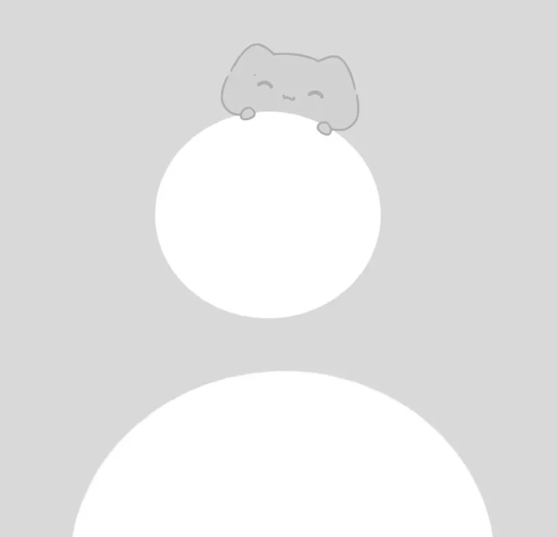

# THIẾT KẾ WEBSITE TIN TỨC VỀ GAME VÀ CÔNG NGHỆ:

## CÔNG CỤ THIẾT KẾ: FIGMA

## A.I SỬ DỤNG: A.I STUDIO

### MỤC TIÊU:

    CẬP NHẬT THÔNG TIN VỀ CÔNG NGHỆ VÀ GAME

### GIAO DIỆN TRANG WEB:

    TRANG CHỦ: HIỂN THỊ TIN TỨC MỚI, LỊCH SỬ ĐỌC, NHỮNG TIN ĐÃ LƯU, GRUOPS ĐÃ THAM GIA


    BÀI VIẾT CHI TIẾT, BÀI VIẾT ĐÃ LƯU: HIỂN THỊ CHI TIẾT BÀI VIẾT ĐƯỢC NHẤN VÀO


    TRANG CÁ NHÂN: HIỂN THỊ NHỮNG THÔNG TIN CÁ NHÂN, SỐ NGÀY ĐỌC LIÊN TIẾP, CHUỖI ĐỌC DÀI NHẤT, NHỮNG KHÍA CẠNH QUAN TÂM NHIỀU NHẤT


### Promp: 

TÔI CÓ ĐOẠN CODE HTML SAU:

```
<!DOCTYPE html>
<html lang="vi">
<head>
    <meta charset="UTF-8">
    <meta name="viewport" content="width=device-width, initial-scale=1.0">
    <title>Trang Chủ</title>
    <!-- GIỮ NGUYÊN: Các liên kết thư viện và CSS -->
    <link rel="stylesheet" href="https://cdnjs.cloudflare.com/ajax/libs/font-awesome/6.4.0/css/all.min.css">
    <link rel="stylesheet" href="./css/style.css">
    <link rel="stylesheet" href="./css/styletc.css">
</head>
<body>

    <header id="main-header">
        <!-- GIỮ NGUYÊN: Thanh tìm kiếm -->
        <div class="search-bar">
            <i class="fa fa-search"></i>
            <input type="text" placeholder="Search">
            <kbd>Ctrl + K</kbd>
        </div>
        
        <nav class="user-nav">
            <!-- GIỮ NGUYÊN: Nút chuông thông báo -->
            <button class="btn-bell">
                <i class="fa-regular fa-bell"></i>
                <span class="notification-badge">1</span>
            </button>

            <div class="status-capsule">
                <!-- GIỮ NGUYÊN: Các chỉ số Streak, Credits, Energy -->
                <div class="status-item">
                    
                    <span class="status-value color-pink">0</span>
                </div>
                <div class="status-item">
                    
                    <span class="status-value">0</span>
                </div>
                <div class="status-item">
                    
                    <span class="status-value">10</span>
                </div>

                <!-- THÊM VÀO: Thẻ <a> bao quanh Avatar để nhấp vào sang trang cá nhân -->
                <a href="thongtin.html" class="user-avatar-wrapper">
                    
                    <span class="online-dot"></span>
                </a>
            </div>
        </nav>
    </header>

    <div class="app-container">
        <!-- GIỮ NGUYÊN: Toàn bộ Sidebar trái -->
        <aside id="left-sidebar">
            <button class="btn-new-post">+ New post</button>
            <nav class="menu-section">
                <a href="trangchu.html" class="menu-item active"><i class="fa fa-home"></i> For You</a>
                <a href="#" class="menu-item"><i class="fa fa-users"></i> Following</a>
                <a href="#" class="menu-item"><i class="fa fa-clock-rotate-left"></i> History</a>
            </nav>
            <section class="menu-section">
                <p class="section-title">Groups</p>
                <a href="#" class="menu-item">Game Developers</a>
                <a href="#" class="menu-item">Machine Learning News</a>
            </section>
        </aside>

        <main id="main-feed">
            <div class="feed-wrapper">
                <!-- GIỮ NGUYÊN: Header của Feed -->
                <header class="feed-header">
                    <h3>For you</h3>
                    <button class="btn-settings">Feed settings <i class="fa fa-sliders"></i></button>
                </header>

                <section class="posts-list">
                    <!-- BÀI VIẾT 1 -->
                    <article class="post-card">
                        <div class="post-user">
                            <!-- THÊM VÀO: Thẻ <a> bọc avatar nhỏ trong bài viết -->
                            <a href="thongtin.html">
                                <div class="avatar-small"></div>
                            </a>
                            <div class="user-info">
                                <h4>Tên người đăng</h4>
                                <time>Thời gian đăng</time>
                            </div>
                        </div>

                        <div class="post-body">
                            <div class="post-content">
                                <!-- THÊM VÀO: Thẻ <a> bọc tiêu đề h2 để sang baiviet.html -->
                                <h2><a href="baiviet.html">Bài viết 1</a></h2>
                            </div>
                            
                            <!-- THÊM VÀO: Thẻ <a> bọc ảnh bài viết để sang baiviet.html -->
                            <a href="baiviet.html" class="post-img-link">
                                
                            </a>
                        </div>
                        <footer class="post-actions">
                            <div class="action-item"><i class="fa fa-arrow-up"></i> 45 <i class="fa fa-arrow-down"></i></div>
                            <div class="action-item"><i class="fa-regular fa-comment"></i></div>
                            <div class="action-item"><i class="fa-regular fa-bookmark"></i></div>
                            <div class="action-item"><i class="fa-share-nodes"></i></div>
                        </footer>
                    </article>
                    

                        <!-- BÀI VIẾT 2 -->
                    <article class="post-card">
                        <div class="post-user">
                            <!-- THÊM VÀO: Thẻ <a> bọc avatar nhỏ trong bài viết -->
                            <a href="thongtin.html">
                                <div class="avatar-small"></div>
                            </a>
                            <div class="user-info">
                                <h4>Tên người đăng</h4>
                                <time>Thời gian đăng</time>
                            </div>
                        </div>

                        <div class="post-body">
                            <div class="post-content">
                                <!-- THÊM VÀO: Thẻ <a> bọc tiêu đề h2 để sang baiviet.html -->
                                <h2><a href="baiviet.html">Bài viết 2</a></h2>
                            </div>
                            
                            <!-- THÊM VÀO: Thẻ <a> bọc ảnh bài viết để sang baiviet.html -->
                            <a href="baiviet.html" class="post-img-link">
                                
                            </a>
                        </div>

                        <!-- GIỮ NGUYÊN: Các nút tương tác Upvote, Comment... -->
                        <footer class="post-actions">
                            <div class="action-item"><i class="fa fa-arrow-up"></i> 45 <i class="fa fa-arrow-down"></i></div>
                            <div class="action-item"><i class="fa-regular fa-comment"></i></div>
                            <div class="action-item"><i class="fa-regular fa-bookmark"></i></div>
                            <div class="action-item"><i class="fa-share-nodes"></i></div>
                        </footer>
                    </article>
                </section>
            </div>
        </main>
    </div>
    
    <!-- GIỮ NGUYÊN: Nút cuộn lên đầu trang -->
    <div class="scroll-top"><i class="fa fa-chevron-up"></i></div>

</body>
</html>
```

VÀ FILE STYLE.CSS NHƯ SAU:

```
/* =========================================
   1. KHAI BÁO BIẾN (CSS VARIABLES)
   ========================================= */
:root {
    /* Colors */
    --bg-body: #ffffff;
    --bg-light: #f3f4f6;
    --border-color: #e5e7eb;
    --text-main: #111827;
    --text-muted: #6b7280;
    --primary-black: #000000;
    --primary-pink: #ec4899;
    --primary-purple: #7c3aed;
    --online-green: #10b981;
    
    /* Dimensions */
    --sidebar-width: 260px;
    --right-sidebar-width: 320px;
    --header-height: 64px;
    --max-content-width: 720px;
    
    /* Effects */
    --transition: all 0.2s cubic-bezier(0.4, 0, 0.2, 1);
    --shadow: 0 4px 12px rgba(0, 0, 0, 0.05);
}

/* =========================================
   2. RESET & BASE STYLES
   ========================================= */
* {
    margin: 0;
    padding: 0;
    box-sizing: border-box;
}

body {
    font-family: 'Inter', -apple-system, BlinkMacSystemFont, "Segoe UI", Roboto, sans-serif;
    background-color: var(--bg-body);
    color: var(--text-main);
    line-height: 1.5;
    -webkit-font-smoothing: antialiased;
}

a {
    text-decoration: none;
    color: inherit;
    transition: var(--transition);
}

ul { list-style: none; }

button {
    cursor: pointer;
    font-family: inherit;
    transition: var(--transition);
}

/* =========================================
   3. SHARED COMPONENTS (HEADER & LEFT SIDEBAR)
   ========================================= */

/* --- Header --- */
#main-header {
    height: var(--header-height);
    border-bottom: 1px solid var(--border-color);
    display: flex;
    align-items: center;
    justify-content: space-between;
    padding: 0 24px;
    position: fixed;
    top: 0;
    width: 100%;
    background: rgba(255, 255, 255, 0.98);
    backdrop-filter: blur(8px);
    z-index: 1000;
}

.search-bar {
    background: var(--bg-light);
    padding: 8px 16px;
    border-radius: 10px;
    width: 350px;
    display: flex;
    align-items: center;
    gap: 12px;
}

.search-bar input { border: none; background: transparent; outline: none; flex: 1; font-size: 14px; }

/* User Nav & Status Capsule */
.user-nav { display: flex; align-items: center; gap: 12px; }

.status-capsule {
    background: var(--bg-light);
    padding: 4px 4px 4px 16px;
    border-radius: 50px;
    display: flex;
    align-items: center;
    gap: 16px;
}

.status-item { display: flex; align-items: center; gap: 6px; }
.status-icon { width: 20px; height: 20px; object-fit: contain; }
.status-value { font-weight: 700; font-size: 14px; }
.color-pink { color: var(--primary-pink); }

/* Avatar Wrapper */
.user-avatar-wrapper {
    position: relative;
    width: 34px;
    height: 34px;
    display: block;
}

.user-avatar { width: 100%; height: 100%; border-radius: 50%; object-fit: cover; background: #ddd; }

.online-dot {
    position: absolute; bottom: -1px; right: -1px;
    width: 11px; height: 11px;
    background: var(--online-green); border: 2px solid white; border-radius: 50%;
}

/* --- Left Sidebar --- */
#left-sidebar {
    width: var(--sidebar-width);
    border-right: 1px solid var(--border-color);
    padding: 24px 12px;
    position: fixed;
    top: var(--header-height);
    height: calc(100vh - var(--header-height));
    overflow-y: auto;
}

.btn-new-post {
    width: 100%; padding: 12px; background: var(--primary-black); color: white;
    border: none; border-radius: 10px; font-weight: 600; margin-bottom: 24px;
}

.btn-bell {
    position: relative;
    background: var(--bg-light); /* Màu xám nhạt */
    border: none;               /* Bỏ viền mặc định của trình duyệt */
    width: 40px;
    height: 40px;
    border-radius: 12px;
    display: flex;
    align-items: center;
    justify-content: center;
    cursor: pointer;
    color: var(--text-muted);
    font-size: 18px;
    margin-right: 8px; /* Khoảng cách với cụm capsule */
}

/* Đảm bảo icon chuông nằm giữa */
.btn-bell i {
    line-height: 1;
}

.menu-section { margin-bottom: 24px; }
.section-title { font-size: 11px; font-weight: 700; color: var(--text-muted); text-transform: uppercase; margin-bottom: 8px; padding-left: 12px; }

.menu-item {
    display: flex; align-items: center; gap: 12px; padding: 10px 12px;
    border-radius: 8px; font-size: 14px; font-weight: 500; margin-bottom: 4px;
}

.menu-item:hover, .menu-item.active { background: var(--bg-light); }
.menu-item i { width: 20px; text-align: center; color: var(--text-muted); }

/* =========================================
   4. HOME PAGE (FEED)
   ========================================= */
.app-container { display: flex; margin-top: var(--header-height); }

#main-feed {
    margin-left: var(--sidebar-width);
    flex: 1;
    padding: 32px;
    display: flex;
    justify-content: center;
}

.feed-wrapper { width: 100%; max-width: var(--max-content-width); }

.feed-header {
    display: flex;
    justify-content: space-between; /* Đẩy tiêu đề sang trái, nút sang phải */
    align-items: center;           /* Căn giữa theo chiều dọc */
    margin-bottom: 24px;
    width: 100%;
}

.feed-header h3 {
    font-size: 20px;
    font-weight: 700;
    color: var(--text-main);
}

.activity-feed {
    text-align: center;
    padding: 60px 20px;
}

.empty-state p {
    color: var(--text-muted);
    font-size: 15px;
    margin-bottom: 20px;
    max-width: 400px;
    margin-left: auto;
    margin-right: auto;
}

.btn-new-post-large {
    background: var(--primary-black);
    color: white;
    border: none;
    padding: 12px 24px;
    border-radius: 12px;
    font-weight: 700;
    cursor: pointer;
}

.btn-settings {
    background: var(--bg-light);
    border: 1px solid var(--border-color);
    padding: 8px 16px;
    border-radius: 10px;
    font-size: 14px;
    font-weight: 600;
    display: flex;
    align-items: center;
    gap: 8px;
    cursor: pointer;
}

.post-card {
    background: white; border: 1px solid var(--border-color);
    border-radius: 16px; padding: 20px; margin-bottom: 16px;
}

.post-user { display: flex; align-items: center; gap: 12px; margin-bottom: 16px; }
.avatar-small { width: 36px; height: 36px; border-radius: 50%; background: #eee; }

.post-body { display: flex; justify-content: space-between; gap: 24px; }
.post-content h2 { font-size: 18px; font-weight: 700; margin-bottom: 8px; }
.post-content h2 a:hover { color: var(--primary-purple); text-decoration: underline; }

.post-img-link { width: 180px; height: 110px; border-radius: 12px; overflow: hidden; flex-shrink: 0; }
.post-image { width: 100%; height: 100%; object-fit: cover; }
.post-img-link:hover .post-image { transform: scale(1.05); transition: 0.3s; }

.post-actions { display: flex; gap: 24px; margin-top: 20px; color: var(--text-muted); font-size: 13px; }
.action-item { display: flex; align-items: center; gap: 6px; cursor: pointer; }


/* =========================================
   5. GLOBAL UTILITIES
   ========================================= */
.scroll-top {
    position: fixed; bottom: 24px; right: 24px;
    width: 40px; height: 40px; background: var(--primary-black); color: white;
    border-radius: 50%; display: flex; align-items: center; justify-content: center;
    box-shadow: var(--shadow); z-index: 99;
}

/* =========================================
   6. RESPONSIVE (LUÔN ĐỂ CUỐI FILE)
   ========================================= */
@media (max-width: 1200px) {
    #right-sidebar { display: none; } /* Ẩn cột phải trên màn hình vừa */
}

@media (max-width: 768px) {
    #left-sidebar { display: none; }
    #main-feed, #profile-content { margin-left: 0; padding: 16px; }
    .search-bar { display: none; }
    .post-body { flex-direction: column-reverse; }
    .post-img-link { width: 100%; height: 200px; }
}
```

KHÔNG ĐƯỢC THAY ĐỔI NỘI DUNG CỦA 2 FILE NÀY

GIÚP TÔI VIẾT FILE "STYLETC.CSS" ĐỂ CÓ GIAO DIỆN GIỐNG VỚI ẢNH SAU NHẤT, KHÔNG CẦN THAY ĐỔI HAY THÊM BẤT KỲ TÍNH NĂNG NÀO MÀ BẠN CÓ THỂ NGHĨ RA, CHỈ CẦN HIỂN THỊ ĐÚNG GIAO DIỆN MÀ TÔI CUNG CẤP LÀ ĐƯỢC


THỰC HIỆN CHỈNH SỬA LẠI NHỮNG ĐIỂM CHƯA HÀI LÒNG ĐỂ RA KẾT QUẢ NHƯ Ý

LÀM TƯƠNG TỰ VỚI NHỮNG TRANG CÒN LẠI

## KẾT QUẢ: 

https://nptb.github.io/myweb.github.io/myweb/trangchu.html
